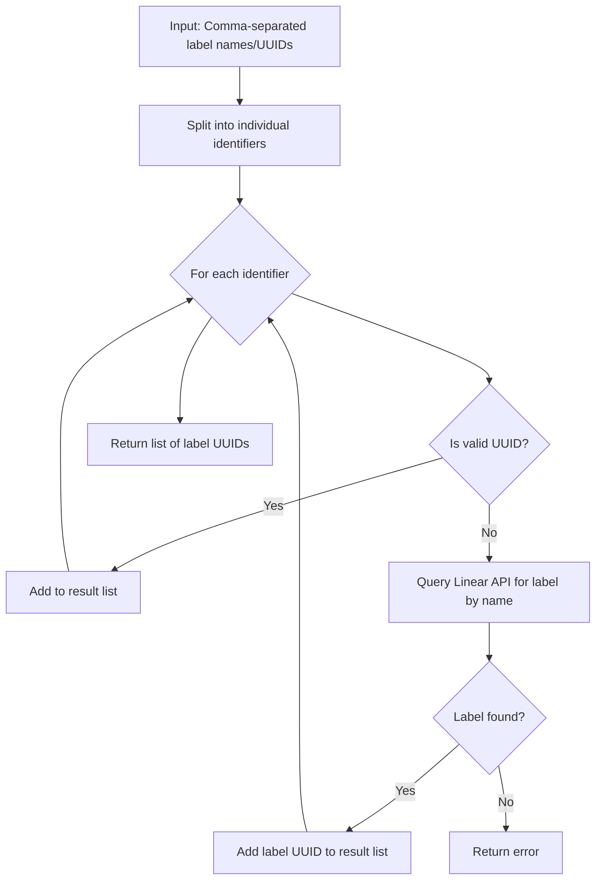
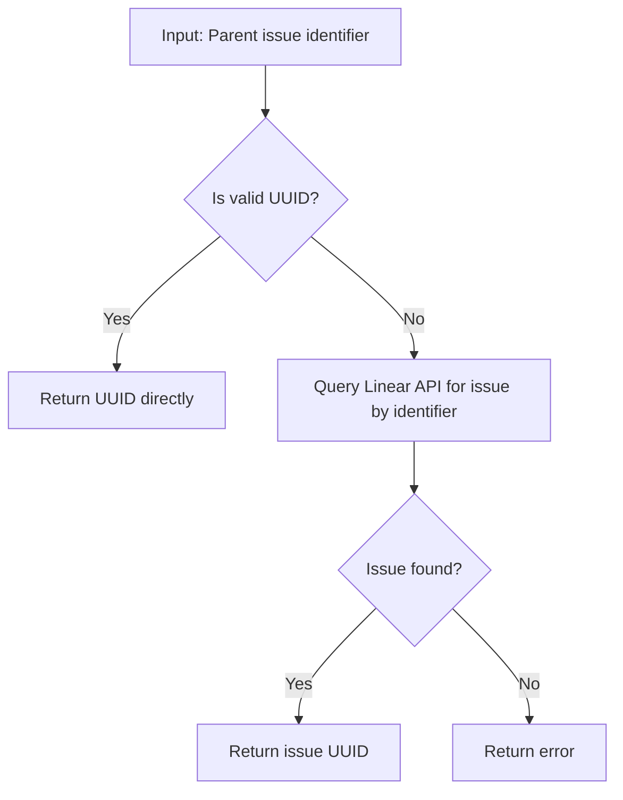

# PRD: Enhance `linear_create_issue` Tool

**Version:** 1.2
**Date:** 2025-03-30
**Status:** Proposed

## 1. Introduction

This document outlines the requirements for completing the implementation of enhancements to the `linear_create_issue` MCP tool within the Linear MCP Server project. This includes adding support for more user-friendly label and parent issue identifiers.

## 2. Goals

-   Enable users to create sub-issues by specifying a parent issue ID or identifier (e.g., "TEAM-123").
-   Enable users to assign labels during issue creation by specifying label IDs or names.
-   Ensure the underlying Linear API client supports these new parameters.
-   Maintain consistency with existing tool design and project patterns.
-   Provide comprehensive test coverage for the new functionality.

## 3. Requirements / Implementation Plan

The following steps are required to complete the implementation:

1.  **Modify Linear Client Data Structures (`pkg/linear/models.go`):**
    *   No changes needed.

2.  **Update Linear Client API Call (`pkg/linear/client.go`):**
    *   No changes needed.

3.  **Enhance MCP Tool Definition (`pkg/server/tools.go`):**
    *   In `RegisterTools`, update the `linear_create_issue` tool definition:
        *   Update `parentIssue` description to: "Optional parent issue ID or identifier (e.g., 'TEAM-123') to create a sub-issue".
        *   Update `labels` description to: "Optional comma-separated list of label IDs or names to assign".

4.  **Implement Label Name Resolution (`pkg/server/tools.go`):**
    *   Create a `resolveLabelIdentifiers` function that:
        *   Takes a Linear client, team ID, and comma-separated string of label names/UUIDs
        *   Splits the string into individual identifiers
        *   For each identifier:
            *   If it's a valid UUID, add it directly to the result list
            *   Otherwise, query the Linear API for labels with the given name
            *   If a label is not found, return an error
        *   Returns a slice of label UUIDs
    *   GraphQL query for finding labels by name:
    ```graphql
    query GetLabelsByName($teamId: ID!, $names: [String!]!) {
      team(id: $teamId) {
        labels(filter: { name: { in: $names } }) {
          nodes {
            id
            name
          }
        }
      }
    }
    ```

5.  **Implement Parent Issue Identifier Resolution (`pkg/server/tools.go`):**
    *   Create a `resolveParentIssueIdentifier` function that:
        *   Takes a Linear client and parent issue identifier (UUID or "TEAM-123")
        *   If it's a valid UUID, returns it directly
        *   Otherwise, queries the Linear API for an issue with that identifier
        *   If an issue is found, returns its UUID
        *   If an issue is not found, returns an error
    *   GraphQL query for finding an issue by identifier:
    ```graphql
    query GetIssueByIdentifier($identifier: String!) {
      issueSearch(filter: { identifier: { eq: $identifier } }, first: 1) {
        nodes {
          id
        }
      }
    }
    ```

6.  **Update MCP Tool Handler (`pkg/server/tools.go`):**
    *   In `CreateIssueHandler`:
        *   Extract optional `parentIssue` and `labels` arguments
        *   If `parentIssue` is present, use `resolveParentIssueIdentifier` to get the parent issue UUID
        *   If `labels` is present, use `resolveLabelIdentifiers` to get the label UUIDs
        *   Update error handling to provide clear messages when resolution fails
        *   Populate the `ParentID` and `LabelIDs` fields in the `linear.CreateIssueInput` struct

7.  **Expand Test Coverage (`pkg/server/tools_test.go`):**
    *   Add new test cases for `create_issue`:
        *   Test creating a sub-issue using the issue identifier (e.g., "TEST-123")
        *   Test creating an issue with labels using label names
        *   Test creating a sub-issue with labels using a mix of label names and UUIDs
    *   Update existing test names and potentially arguments if needed for clarity

8.  **Update Test Fixtures (`testdata/fixtures/` & `testdata/golden/`):**
    *   Re-record VCR fixtures for new/modified `create_issue_handler` tests using `go test -v -recordWrites=true ./...`
        *   Requires a valid `LINEAR_API_KEY`
        *   Requires appropriate parent issues and labels in the test workspace
    *   Update corresponding `.golden` files with expected output

9.  **Documentation (`README.md`, `memory-bank/`):**
    *   Update `README.md` usage examples for `linear_create_issue`
    *   Update `memory-bank/progress.md` upon completion
    *   Update `.clinerules` if new patterns emerge

## 4. Resolution Workflows

### Label Resolution Workflow



### Parent Issue Resolution Workflow



## 5. Success Criteria

-   The `linear_create_issue` tool successfully creates sub-issues when `parentIssue` is provided as an ID or identifier.
-   The `linear_create_issue` tool successfully assigns labels when `labels` are provided as IDs or names.
-   All new test cases pass, including VCR playback.
-   Documentation accurately reflects the tool's updated capabilities.

## 6. Implementation Decisions

-   **Input Validation**: Delegate to Linear API for input validation as much as possible, rather than implementing extensive client-side validation.
-   **Label Limits**: No limits will be imposed on the number of labels that can be assigned at once.
-   **Error Handling**: Provide clear error messages when resolution fails, but rely on Linear API for validation of the resolved UUIDs.
