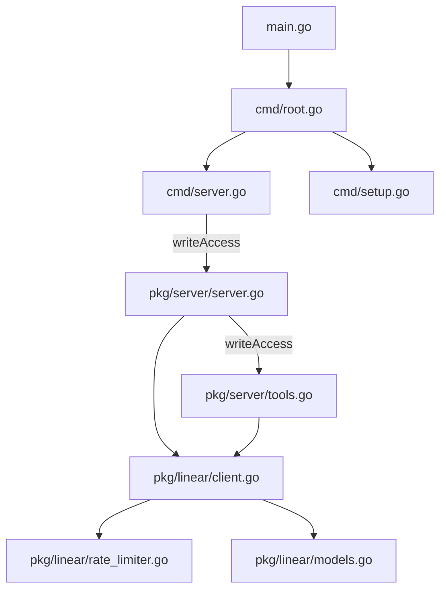

# System Patterns: Linear MCP Server

## System Architecture
The Linear MCP Server follows a modular architecture with clear separation of concerns:



1. **Main Module** (`main.go`): Entry point that initializes the command structure.
2. **Command Module** (`cmd/`): Handles command-line interface and subcommands.
   - **Root Command** (`cmd/root.go`): Base command that serves as the entry point for all subcommands.
   - **Server Command** (`cmd/server.go`): Handles the server functionality.
   - **Setup Command** (`cmd/setup.go`): Handles the setup functionality for AI assistants.
3. **Server Module** (`pkg/server`): Handles MCP protocol implementation and tool registration.
4. **Linear Client Module** (`pkg/linear`): Manages communication with the Linear API.

## Key Technical Decisions

### 1. Command-Line Interface
- Uses the Cobra library for command-line handling.
- Implements a subcommand structure for different functionalities.
- Provides consistent flag handling across subcommands.

### 2. Write Access Control
- Implements write access control (default: disabled) to control access to write operations.
- Command-line flag `--write-access` determines whether write tools are registered.
- Write operations (`linear_create_issue`, `linear_update_issue`, `linear_add_comment`) are only available when write access is enabled.

### 3. Setup Automation
- Automates the installation and configuration process for AI assistants.
- Checks for existing binary before downloading.
- Merges new settings with existing settings to preserve user configuration.
- Supports multiple AI assistants (starting with Cline).

### 4. MCP Protocol Implementation
- Uses the `github.com/mark3labs/mcp-go` library for MCP server implementation.
- Implements the standard MCP protocol for tool registration and execution.

### 5. Linear API Integration
- Custom Linear client implementation in the `pkg/linear` package.
- Handles authentication, request formatting, and response parsing.

### 6. Rate Limiting
- Implements rate limiting to respect Linear API quotas.
- Uses a simple rate limiter to prevent API quota exhaustion.

### 7. Error Handling
- Consistent error handling patterns throughout the codebase.
- Errors are propagated up and formatted according to MCP specifications.

### 8. Testing Strategy
- Uses `go-vcr` for recording and replaying HTTP interactions in tests.
- Test fixtures stored in `testdata/fixtures/`.

## Design Patterns

### 1. Command Pattern
- The Cobra library implements the Command pattern for handling CLI commands.
- Each command is a separate object with its own run method.
- Commands can have subcommands, creating a hierarchical command structure.

### 2. Factory Pattern
- `NewLinearMCPServer()` and `NewLinearClientFromEnv()` functions create and initialize complex objects.

### 3. Dependency Injection
- The Linear client is injected into tool handlers, promoting testability and loose coupling.

### 4. Handler Pattern
- Each MCP tool has a dedicated handler function that processes requests and returns results.

### 5. Builder Pattern
- MCP tools are constructed using a builder-like pattern with the `mcp.NewTool()` function and various `With*` methods.

## MCP Tool Registration Patterns

### Tool Registration Process
- All tools are registered in the `RegisterTools` function in `pkg/server/tools.go`
- Tools are conditionally registered based on write access permissions
- Each tool follows a consistent registration pattern:

```go
server.AddTool(mcp.NewTool("tool_name").
    WithDescription("Tool description").
    WithInputSchema(mcp.Object{
        "param1": mcp.String().WithDescription("Parameter description"),
        "param2": mcp.Required(mcp.String()).WithDescription("Required parameter"),
    }).
    WithHandler(toolHandlerFunction))
```

### Tool Handler Structure
- Each tool has a dedicated handler function that processes MCP requests
- Handler functions follow a consistent pattern:
  1. Extract and validate parameters from the request
  2. Call appropriate Linear client methods
  3. Format and return the response
- Error handling is consistent across all handlers
- Response formatting follows MCP specifications

### Parameter Definition Patterns
- Tool parameters are defined using the MCP schema format
- Required parameters are marked with `mcp.Required()`
- Parameter types include: `mcp.String()`, `mcp.Number()`, `mcp.Boolean()`
- All parameters include descriptive help text
- Optional parameters have sensible defaults where applicable

### Write Access Control
- Write operations are controlled by the `writeAccess` flag
- Read-only tools are always registered
- Write tools (`linear_create_issue`, `linear_update_issue`, `linear_add_comment`) are only registered when write access is enabled
- This provides a security layer to prevent accidental modifications

## Linear API Integration Patterns

### Client Architecture
- The Linear client is implemented in `pkg/linear/client.go`
- Client provides high-level methods that abstract GraphQL complexity
- All API interactions go through the centralized client

### Authentication Pattern
- Authentication is handled via the `LINEAR_API_KEY` environment variable
- API key is validated on first API request, not at startup
- No support for other authentication methods currently
- Client includes the API key in all requests via Authorization header

### Rate Limiting Implementation
- Simple rate limiter implemented to respect Linear's API quotas
- Rate limiting is applied at the client level before making requests
- Current implementation uses a basic token bucket approach
- Rate limits are not configurable (hardcoded values)

### API Response Handling
- API responses are parsed into Go structs defined in `pkg/linear/models.go`
- JSON unmarshaling handles nested structures (e.g., `LabelConnection`)
- Error responses from Linear API are translated into user-friendly messages
- GraphQL errors are properly extracted and formatted

### GraphQL Query Patterns
- All Linear API interactions use GraphQL queries and mutations
- Queries are embedded as string literals in the client methods
- Parameter types in queries match Linear API expectations (e.g., `String!` vs `ID!`)
- Query structure follows Linear's API schema requirements

### Identifier Resolution Strategy
- Flexible identifier resolution allows users to specify entities by:
  - UUID (direct API identifier)
  - Human-readable identifiers (e.g., "TEAM-123" for issues)
  - Names (e.g., team names, label names)
- Resolution functions handle the translation from user input to API identifiers
- Error handling provides clear feedback when identifiers cannot be resolved

## Component Relationships

### Commands and Subcommands
- The root command serves as the entry point for all subcommands.
- Subcommands handle specific functionalities (server, setup).
- Each subcommand has its own flags and run method.

### Server and Tools
- The server registers tools during initialization.
- Each tool has a handler function that processes requests.
- Tools are defined with schemas that specify required and optional parameters.

### Linear Client and API
- The Linear client translates MCP tool calls into Linear API requests.
- It handles authentication, request formatting, and response parsing.
- The rate limiter ensures API quotas are respected.

## Data Flow

1. **Command Flow**:
   ```mermaid
   sequenceDiagram
       participant User
       participant Main as main.go
       participant Root as cmd/root.go
       participant Cmd as Subcommand
       participant Action as Command Action
       
       User->>Main: Execute Command
       Main->>Root: Execute Root Command
       Root->>Cmd: Parse and Execute Subcommand
       Cmd->>Action: Execute Command Action
       Action->>User: Return Result
   ```

2. **Setup Flow**:
   ```mermaid
   sequenceDiagram
       participant User
       participant Setup as cmd/setup.go
       participant Binary as Binary Management
       participant Config as Configuration Management
       
       User->>Setup: Execute Setup Command
       Setup->>Binary: Check for Existing Binary
       Binary-->>Setup: Binary Status
       alt Binary Not Found
           Setup->>Binary: Download Latest Release
           Binary-->>Setup: Binary Path
       end
       Setup->>Config: Create/Update Configuration
       Config-->>Setup: Configuration Status
       Setup->>User: Setup Complete
   ```

3. **Request Flow**:
   ```mermaid
   sequenceDiagram
       participant Client as MCP Client
       participant Server as MCP Server
       participant Tool as Tool Handler
       participant Linear as Linear Client
       participant API as Linear API
       
       Client->>Server: Call Tool Request
       Server->>Tool: Forward Request
       Tool->>Linear: Translate Request
       Linear->>API: API Request
       API->>Linear: API Response
       Linear->>Tool: Parsed Response
       Tool->>Server: Formatted Result
       Server->>Client: Tool Result
   ```

4. **Error Flow**:
   ```mermaid
   sequenceDiagram
       participant Client as MCP Client
       participant Server as MCP Server
       participant Tool as Tool Handler
       participant Linear as Linear Client
       participant API as Linear API
       
       Client->>Server: Call Tool Request
       Server->>Tool: Forward Request
       Tool->>Linear: Translate Request
       Linear->>API: API Request
       API->>Linear: Error Response
       Linear->>Tool: Error
       Tool->>Server: Error Result
       Server->>Client: Error Result
   ```

## Code Organization
- **main.go**: Entry point that initializes the command structure
- **cmd/root.go**: Root command that serves as the base for all subcommands
- **cmd/server.go**: Server command that handles the server functionality
- **cmd/setup.go**: Setup command that handles the setup functionality for AI assistants
- **pkg/server/server.go**: Server initialization and management
- **pkg/server/tools.go**: Tool definitions and handlers
- **pkg/linear/client.go**: Linear API client implementation
- **pkg/linear/models.go**: Data models for Linear API requests and responses
- **pkg/linear/rate_limiter.go**: Rate limiting implementation
- **pkg/linear/test_helpers.go**: Test utilities
