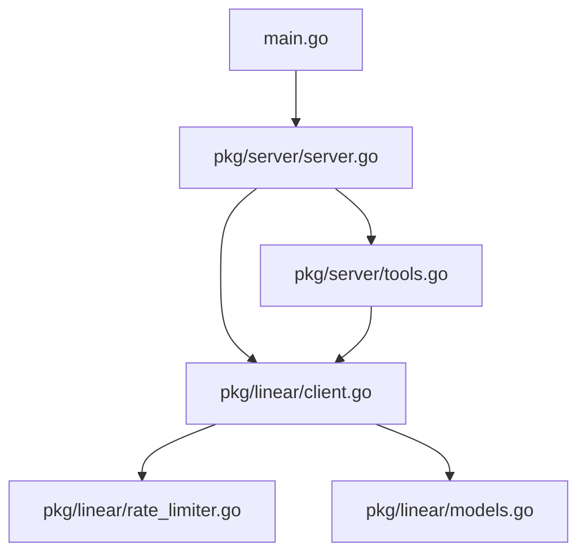

# System Patterns: Linear MCP Server

## System Architecture
The Linear MCP Server follows a modular architecture with clear separation of concerns:



1. **Main Module** (`main.go`): Entry point that initializes and starts the server.
2. **Server Module** (`pkg/server`): Handles MCP protocol implementation and tool registration.
3. **Linear Client Module** (`pkg/linear`): Manages communication with the Linear API.

## Key Technical Decisions

### 1. MCP Protocol Implementation
- Uses the `github.com/mark3labs/mcp-go` library for MCP server implementation.
- Implements the standard MCP protocol for tool registration and execution.

### 2. Linear API Integration
- Custom Linear client implementation in the `pkg/linear` package.
- Handles authentication, request formatting, and response parsing.

### 3. Rate Limiting
- Implements rate limiting to respect Linear API quotas.
- Uses a simple rate limiter to prevent API quota exhaustion.

### 4. Error Handling
- Consistent error handling patterns throughout the codebase.
- Errors are propagated up and formatted according to MCP specifications.

### 5. Testing Strategy
- Uses `go-vcr` for recording and replaying HTTP interactions in tests.
- Test fixtures stored in `testdata/fixtures/`.

## Design Patterns

### 1. Factory Pattern
- `NewLinearMCPServer()` and `NewLinearClientFromEnv()` functions create and initialize complex objects.

### 2. Dependency Injection
- The Linear client is injected into tool handlers, promoting testability and loose coupling.

### 3. Handler Pattern
- Each MCP tool has a dedicated handler function that processes requests and returns results.

### 4. Builder Pattern
- MCP tools are constructed using a builder-like pattern with the `mcp.NewTool()` function and various `With*` methods.

## Component Relationships

### Server and Tools
- The server registers tools during initialization.
- Each tool has a handler function that processes requests.
- Tools are defined with schemas that specify required and optional parameters.

### Linear Client and API
- The Linear client translates MCP tool calls into Linear API requests.
- It handles authentication, request formatting, and response parsing.
- The rate limiter ensures API quotas are respected.

## Data Flow

1. **Request Flow**:
   ```mermaid
   sequenceDiagram
       participant Client as MCP Client
       participant Server as MCP Server
       participant Tool as Tool Handler
       participant Linear as Linear Client
       participant API as Linear API
       
       Client->>Server: Call Tool Request
       Server->>Tool: Forward Request
       Tool->>Linear: Translate Request
       Linear->>API: API Request
       API->>Linear: API Response
       Linear->>Tool: Parsed Response
       Tool->>Server: Formatted Result
       Server->>Client: Tool Result
   ```

2. **Error Flow**:
   ```mermaid
   sequenceDiagram
       participant Client as MCP Client
       participant Server as MCP Server
       participant Tool as Tool Handler
       participant Linear as Linear Client
       participant API as Linear API
       
       Client->>Server: Call Tool Request
       Server->>Tool: Forward Request
       Tool->>Linear: Translate Request
       Linear->>API: API Request
       API->>Linear: Error Response
       Linear->>Tool: Error
       Tool->>Server: Error Result
       Server->>Client: Error Result
   ```

## Code Organization
- **pkg/server/server.go**: Server initialization and management
- **pkg/server/tools.go**: Tool definitions and handlers
- **pkg/linear/client.go**: Linear API client implementation
- **pkg/linear/models.go**: Data models for Linear API requests and responses
- **pkg/linear/rate_limiter.go**: Rate limiting implementation
- **pkg/linear/test_helpers.go**: Test utilities
